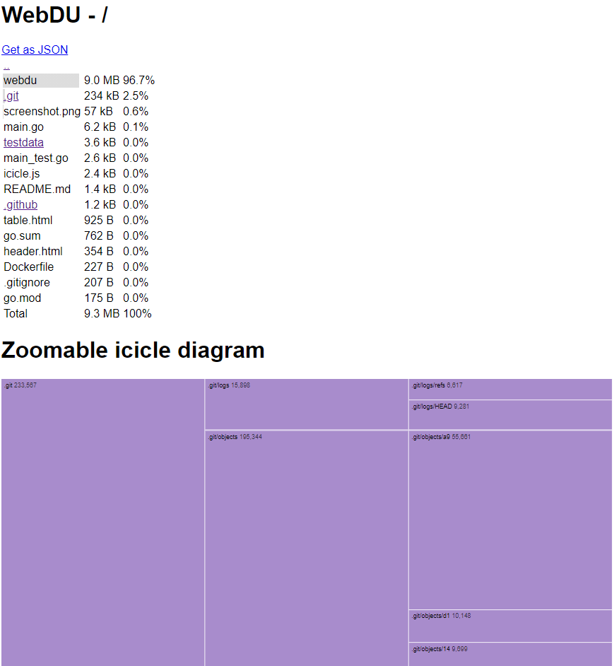

# webdu

[](https://travis-ci.org/lutzky/webdu)
[](https://codecov.io/gh/lutzky/webdu)
[](https://microbadger.com/images/lutzky/webdu "Get your own version badge on microbadger.com")
[](https://microbadger.com/images/lutzky/webdu "Get your own image badge on microbadger.com")
[](https://hub.docker.com/r/lutzky/webdu/builds)
[](https://hub.docker.com/r/lutzky/webdu/builds)

WebDU is a simple web interface for disk usage.

## Screenshot



## Usage

Some variables to make the example simpler:

```shell
PORT=8099 # The default port
BASEPATH=/path/to/relevant/files # Whatever path you want
```

Then, either use directly:

```
go build webdu
./webdu --base_path $BASEPATH --port $PORT
```

...or with docker:

```shell
docker run -p $PORT:8099 -v $BASEPATH:/data:ro \
  lutzky/webdu --base_path=/data
```

Then point your browser at http://localhost:8099/.

Note that http://localhost:8099/any/path/at/all will work as well, which is useful for putting webdu behind a reverse proxy. See http://github.com/lutzky/wamc for an example.
